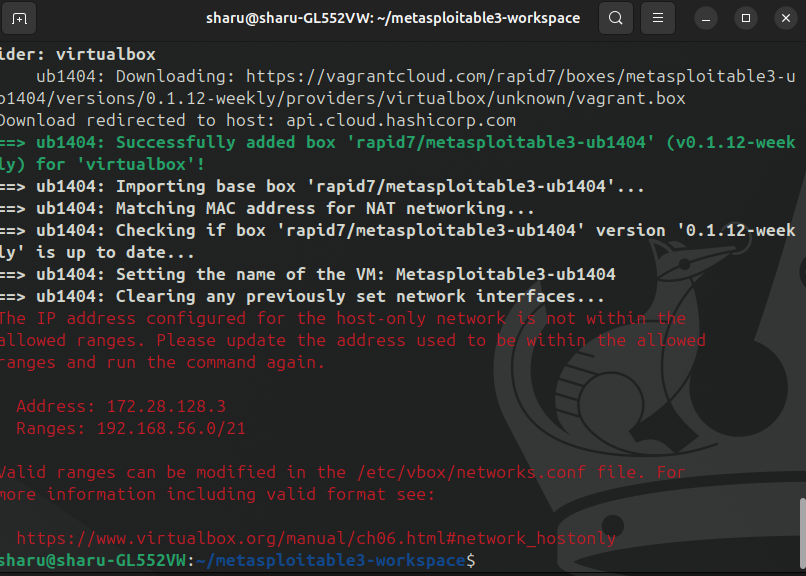
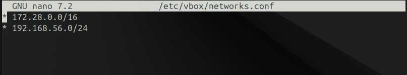
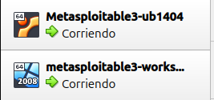
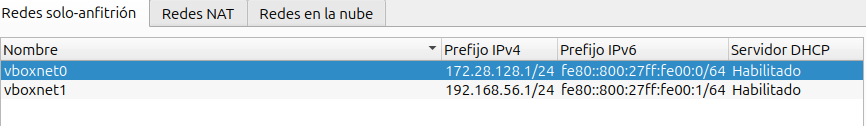
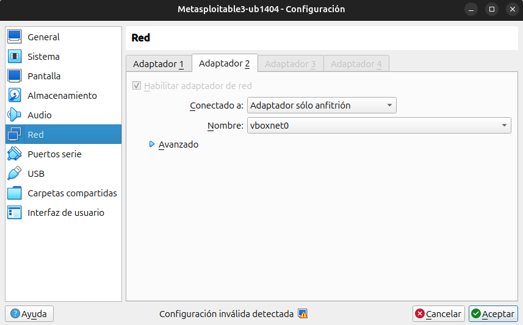

# Instalaci-n-de-Metasploitable-3-en-Ubuntu

## Requisitos previos

Para usar Metasploitable 3, vamos a necesitar hacer primero un par de cosas:

* Instalar Vagrant
* Crear un archivo de configuración en /etc/vbox
* Virtualbox 7.0 o inferior (Virtualbox 7.1 no es soportado)

## Instalación de Vagrant

```bash

    wget -O- https://apt.releases.hashicorp.com/gpg| sudo gpg --dearmor -o /usr/share/keyrings/hashicorp-archive-keyring.gpg

    echo "deb [signed-by=/usr/share/keyrings/hashicorp-archive-keyring.gpg] https://apt.releases.hashicorp.com $(lsb_release -cs) main" | sudo tee /etc/apt/sources.list.d/hashicorp.list

    sudo apt update && sudo apt install vagrant
```

## Creación de un archivo de configuración en /etc/vbox

Creamos el directorio de Metasploitable 3

```bash
mkdir metasploitable3-workspace
```
Entrando en el directorio y descargando los archivos con curl:

```bash
cd metasploitable3-workspace

curl -O https://raw.githubusercontent.com/rapid7/metasploitable3/master/Vagrantfile && vagrant up

```



Error:Nos dice que la dirección IP configurada para el host no está dentro de los rangos permitidos.
Esto esporque no hemos 
configurado  el archivo `/etc/vbox`.

**Primero tenemos que crear la ruta /etc/vbox con el archivo networks.conf, pues no están por defecto ni el directorio no el archivo.**

```bash
sudo mkdir /etc/vbox
sudo nano /etc/vbox/networks.conf
```
Para permitir el rango, en este caso la red 172.28.0.0/16 (Para evitarnos problemas, ya que podríamos permitir solo la IP).

Introducimos lo siguiente en el archivo 
`nano /etc/vbox/networks.conf`:

```bash
* 172.28.0.0/16
* 192.168.56.0/24
```



La 192.168.56.0 es la red para la máquina Windows, si no lo añadimos, nos dará otro error al hacer `vagrant up`

**¡OJO! He cogido el rango en base a la dirección que me daba el error de la imagen anterior, también es obligatorio usar el * para indicar el comienzo del rango o la IP que vamos a declarar en el archivo de configuración.**

Hacemos un `vagrant up` en el directorio metasploitable3-workspace, al hacerlo, nos empezará a importar las máquinas tanto de Linux como de Windows vulnerables en VirtualBox. Al terminar, si vamos a VirtualBox, veremos las 2 máquinas importadas y en ejecución.



El resultado debería ser que tenemos 2 máquinas que no teníamos antes y en estado Corriendo. 
El usuario y contraseña de ambas máquinas es vagrant/vagrant 
Si vamos a Archivo>Herramientas>Administrador de red vemos las 2 redes que se han creado y que vemos en las máquinas 
 





